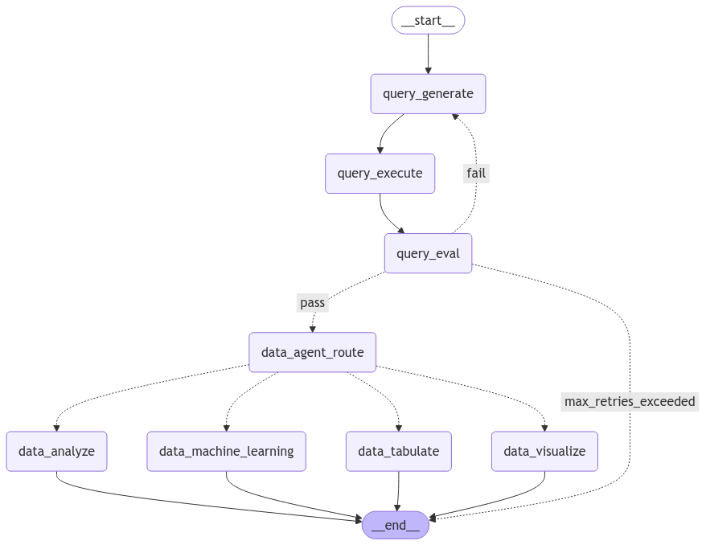

# csv-avd

## Description
A multi agent AI system that analyzes CSV and XLSX files and answers questions about the data.

## Installation
1. Clone the repository
2. Provide the environment variables for backend in the directory `backend/.env`. See `backend/.env.example` for reference.
3. Run docker-compose
```bash
docker-compose up --build -d
```
or
```bash
docker compose up --build -d
```
based on your docker configuration.

4. Access the frontend at http://localhost:3000

## Usage
1. Upload a CSV or XLSX file and write a question.
2. Or use question samples provided on the cards.
3. Click on the Send button to get the answer.
4. Generates answers in 4 predefined formats:
    - Analyze: Provides a report of the subset of the data you are interested in according to the question.
    - Tabulate: Provides a tabular representation of the subset of the data you are interested in.
    - Visualize: Provides a visualization of the data including bar chart, pie chart, and line chart.
    - Machine Learning: Runs a machine learning model that predicts the data based on the subset of the data you are interested in and generates a report on the model results.

## Features
1. Routing: A type of router workflow is implemented to handle the routing of the data queries:
    - data_analyze
    - data_tabulate
    - data_visualize
    - data_machine_learning
    The router agent 'data_agent_route' routes the data to the respective agents based on the user question.
    For more details: [Router](https://langchain-ai.github.io/langgraph/tutorials/workflows/#routing)
2. Evaluator-optimizer: 'query_generate', 'query_execute', and 'query_evaluate' agents form the evaluator-optimizer workflow. If the 'query_execute' agent raises an error about the query, the 'query_evaluate' agent feeds the query to the 'query_generate' agent to generate a new query. The 'query_execute' agent then executes the new query. This feedback loop continues until the query is successfully executed or the maximum number of iterations is reached('max_retries_exceeded' signal is raised).
    For more details: [Evaluator-Optimizer](https://langchain-ai.github.io/langgraph/tutorials/workflows/#evaluator-optimizer)
3. LLM with tools: The 'data_machine_learning' agent uses the LLM with Python REPL tool to generate a machine learning model based on the subset of the data you are interested in.
    For more details: [LLM with tools](https://python.langchain.com/docs/how_to/tools_model_specific/) - [Python REPL](https://python.langchain.com/docs/integrations/tools/python/)


## Workflow


## Demo
https://github.com/user-attachments/assets/8d16c11f-58d3-4df7-91f8-19961e347a95


